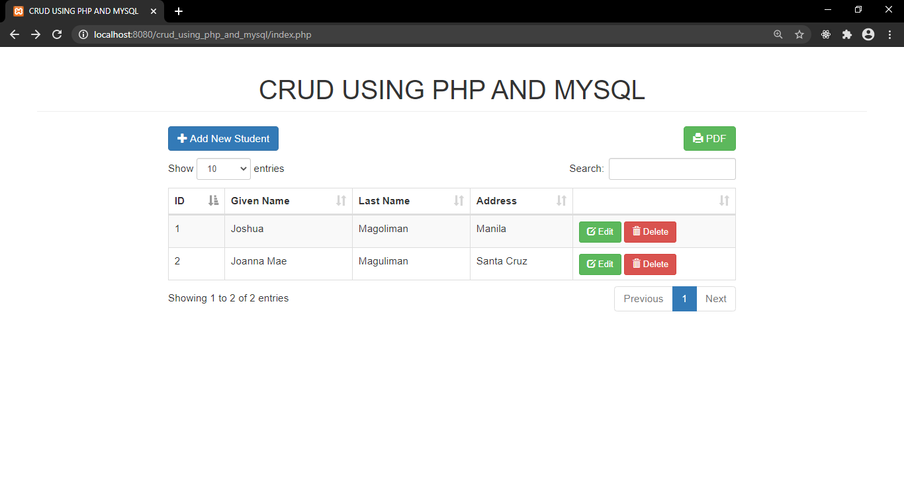
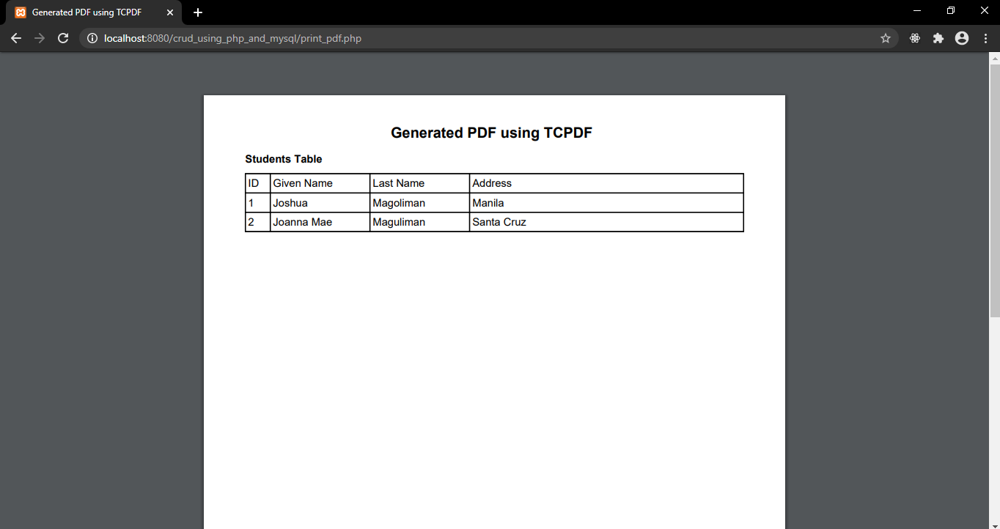

# CRUD USING PHP AND MYSQL

* Purpose: My Project
* Front End: HTML5, CSS3, JavaScript, Bootstrap, jQuery, DataTables, TCPDF
* Back End: PHP, MySQL
* Responsive Web Design: Yes
* Type of Website: Dynamic

<h2> User Interface Screenshots </h2> 
  
    
  
	